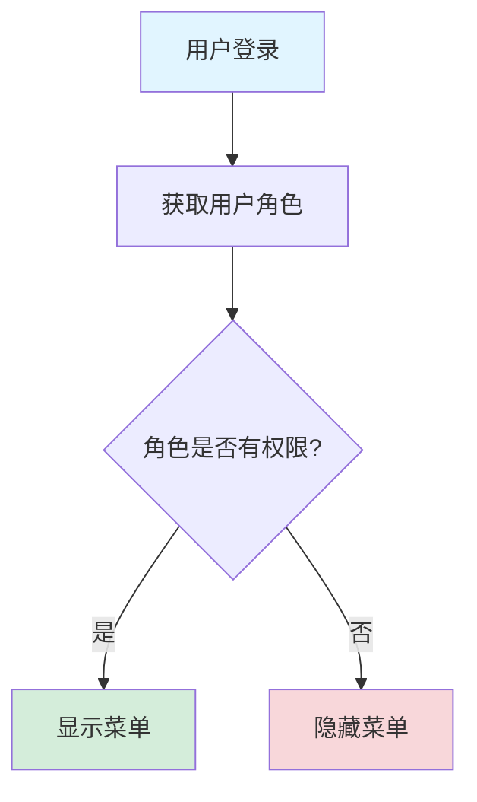

# 多租户表隔离策略说明

## 📋 概述

本文档说明系统中各业务表的多租户隔离策略，帮助理解哪些表需要租户隔离，哪些表应该共享。

---

## 🎯 设计原则

### 1. **数据隔离**（Tenant Isolation）
- 租户私有数据必须严格隔离
- 通过 `tenant_id` 字段实现
- MyBatis-Plus 多租户插件自动添加过滤条件

### 2. **功能共享**（Feature Sharing）
- 系统功能定义应该标准化
- 避免重复数据和维护成本
- 通过角色和权限控制访问

### 3. **灵活配置**（Flexible Configuration）
- 通过配置文件控制隔离策略
- 可随时调整隔离范围
- 零成本切换单租户/多租户

---

## 📊 表隔离策略

### ✅ 需要租户隔离的表

这些表存储租户私有数据，必须添加 `tenant_id` 字段：

| 表名 | 说明 | 隔离原因 |
|------|------|---------|
| `sys_user` | 用户表 | 用户属于特定租户，数据必须隔离 |
| `sys_role` | 角色表 | 角色是租户自定义的，不同租户角色不同 |
| `sys_dept` | 部门表 | 部门结构是租户私有的组织架构 |
| `sys_notice` | 通知公告表 | 通知是租户内部的信息 |
| `sys_log` | 系统日志表 | 日志记录租户的操作行为 |
| `sys_role_menu` | 角色菜单关联表 | 角色是租户隔离的，关联表也需要隔离 |
| `sys_user_role` | 用户角色关联表 | 用户和角色都是租户隔离的 |
| `ai_command_record` | AI命令记录表 | 命令记录是租户私有数据 |

**实现方式**：
```sql
-- 添加 tenant_id 字段
ALTER TABLE `sys_user` 
ADD COLUMN `tenant_id` bigint DEFAULT 1 COMMENT '租户ID' AFTER `id`,
ADD INDEX `idx_tenant_id` (`tenant_id`);

-- 初始化为默认租户
UPDATE `sys_user` SET `tenant_id` = 1 WHERE `tenant_id` IS NULL;
```

---

### ❌ 不需要租户隔离的表

这些表存储系统公共数据，应该所有租户共享：

| 表名 | 说明 | 共享原因 |
|------|------|---------|
| `sys_tenant` | 租户表 | 租户表本身不能隔离 |
| **`sys_menu`** | **菜单表** | **功能入口定义，标准化共享** |
| `sys_dict` | 字典表 | 系统字典通常是标准化的 |
| `sys_dict_item` | 字典项表 | 字典值应该统一 |
| `sys_config` | 系统配置表 | 系统级配置应该全局统一 |

**配置方式**：
```yaml
youlai:
  tenant:
    enabled: true
    ignore-tables:
      - sys_tenant      # 租户表本身
      - sys_menu        # 菜单表（重点！）
      - sys_dict        # 字典表
      - sys_dict_item   # 字典项表
      - sys_config      # 系统配置表
```

---

## 🔍 重点说明：为什么菜单不隔离？

### 问题背景
```sql
-- 错误示例：如果菜单隔离，会产生大量冗余
租户A的菜单：
  - 系统管理 → 用户管理 → 角色管理
租户B的菜单：
  - 系统管理 → 用户管理 → 角色管理
租户C的菜单：
  - 系统管理 → 用户管理 → 角色管理
（完全相同的菜单定义重复了3次！）
```

### 推荐方案：菜单共享 + 角色控制

#### 1. **菜单定义共享**
```
所有租户共享同一套菜单定义：
├─ 系统管理
│  ├─ 用户管理
│  ├─ 角色管理
│  ├─ 菜单管理
│  └─ 租户管理
├─ 业务管理
│  ├─ 订单管理
│  └─ 商品管理
```

#### 2. **权限通过角色控制**
```typescript
// 租户A的管理员角色
角色：租户A管理员
权限：系统管理、业务管理（全部菜单）

// 租户A的普通员工角色
角色：租户A员工
权限：业务管理（部分菜单）

// 租户B的管理员角色
角色：租户B管理员
权限：系统管理、业务管理（全部菜单）
```

#### 3. **优势**

| 维度 | 菜单共享 | 菜单隔离 |
|------|---------|---------|
| **数据量** | ✅ 少量 | ❌ 大量冗余 |
| **升级维护** | ✅ 一次升级 | ❌ 需迁移所有租户 |
| **管理成本** | ✅ 低 | ❌ 高 |
| **功能一致性** | ✅ 保证统一 | ⚠️ 可能不一致 |
| **定制能力** | ⚠️ 通过角色实现 | ✅ 每租户独立 |

---

## 💡 权限控制流程

### 用户访问菜单的流程



### 示例代码

```java
// 1. 菜单定义（所有租户共享）
sys_menu:
  id: 1, name: "用户管理", perm: "sys:user:list"

// 2. 租户A的角色（租户隔离）
sys_role (tenant_id=1):
  id: 10, name: "管理员", tenant_id: 1

// 3. 角色菜单关联（租户隔离）
sys_role_menu (tenant_id=1):
  role_id: 10, menu_id: 1, tenant_id: 1
  
// 查询时自动过滤
SELECT t3.perm, t2.code 
FROM sys_role_menu t1
INNER JOIN sys_role t2 ON t1.role_id = t2.id 
  AND t2.tenant_id = 1  -- ✅ 角色租户过滤
INNER JOIN sys_menu t3 ON t1.menu_id = t3.id
  -- ❌ 菜单不需要租户过滤（通过 ignore-tables 配置）
WHERE t1.tenant_id = 1  -- ✅ 关联表租户过滤
```

---

## 🔧 配置示例

### application-dev.yml

```yaml
youlai:
  tenant:
    # 启用多租户
    enabled: true
    
    # 租户字段名
    column: tenant_id
    
    # 默认租户ID
    default-tenant-id: 1
    
    # 忽略多租户过滤的表（重点配置）
    ignore-tables:
      - sys_tenant      # 租户表本身
      - sys_menu        # 菜单表（所有租户共享）
      - sys_dict        # 字典表
      - sys_dict_item   # 字典项表
      - sys_config      # 系统配置表
```

---

## ⚠️ 常见问题

### Q1: 如果需要为不同租户定制菜单怎么办？

**A:** 有两种方案：

#### 方案1: 通过角色权限控制（推荐）
```
租户A看到：菜单A、B、C（通过角色权限配置）
租户B看到：菜单A、B（通过角色权限配置）
```

#### 方案2: 菜单隔离（不推荐）
```yaml
# 将 sys_menu 从 ignore-tables 中移除
ignore-tables:
  - sys_tenant
  # - sys_menu  # 注释掉，启用菜单隔离

# 然后执行 SQL 添加 tenant_id
ALTER TABLE sys_menu 
ADD COLUMN tenant_id bigint DEFAULT 1;
```

---

### Q2: 如果后端报错 `Unknown column 't3.tenant_id'` 怎么办？

**A:** 这个错误说明：
1. ❌ `sys_menu` 表没有 `tenant_id` 字段
2. ❌ 但配置文件中没有将 `sys_menu` 添加到 `ignore-tables`
3. ✅ 解决方案：将 `sys_menu` 添加到 `ignore-tables`（本文档已说明）

---

### Q3: 字典表需要隔离吗？

**A:** 通常不需要，原因：
- 字典是系统标准配置（如：性别、状态等）
- 所有租户应该使用统一的字典定义
- 如果需要租户级字典，可以单独创建 `tenant_dict` 表

---

## 📝 总结

### 核心原则

1. **数据隔离**：用户、角色、部门等业务数据必须隔离
2. **功能共享**：菜单、字典、配置等系统定义应该共享
3. **权限控制**：通过角色和权限实现访问控制

### 最佳实践

```
✅ 推荐做法：
- 菜单定义共享
- 角色租户隔离
- 通过角色控制菜单访问权限

❌ 不推荐做法：
- 为每个租户复制菜单
- 菜单和角色都隔离但逻辑相同
- 升级时需要迁移所有租户的菜单
```

---

## 🔗 相关文档

- [多租户用户管理改进说明](./多租户用户管理改进说明.md)
- [tenant_add.sql](../sql/mysql/tenant_add.sql) - 多租户SQL脚本
- [TenantProperties.java](../src/main/java/com/youlai/boot/config/property/TenantProperties.java) - 配置类

---

**更新时间**：2025-12-12
**版本**：v3.0.0
